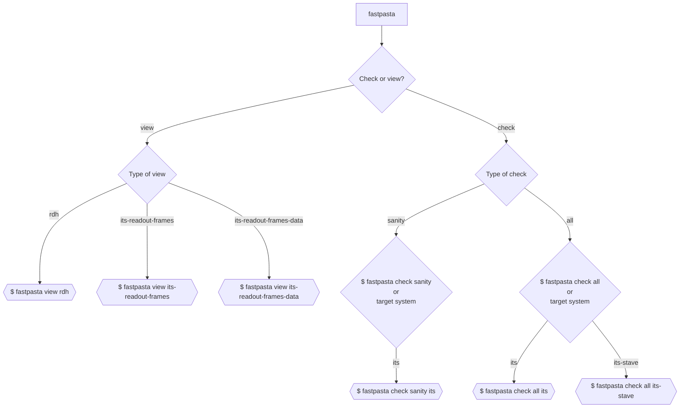

# fastPASTA
[](https://gitlab.cern.ch/mkonig/fastpasta/-/commits/master)
 [](https://gitlab.cern.ch/mkonig/fastpasta/-/commits/master)
 [](https://gitlab.cern.ch/mkonig/fastpasta/-/releases)


## fast Protocol Analysis Scanner Tool for ALICE

For an exhaustive list of the data verification done via the `check` subcommand, see [doc/checks_list.md](https://gitlab.cern.ch/mkonig/fastpasta/-/blob/master/doc/checks_list.md).

Releases and associated changelogs can be found at [releases](https://gitlab.cern.ch/mkonig/fastpasta/-/releases) or [CHANGELOG.md](CHANGELOG.md).

See more example including advanced senarios in [examples document](examples.md).

Looking for more details? see the [Documentation for developers](#documentation-for-developers) section.

## Purpose

To verify or view curated content of the scanned raw binary data from the ALICE detector at CERN.

## Demo


# Table of Contents
- [fastPASTA](#fastpasta)
  - [fast Protocol Analysis Scanner Tool for ALICE](#fast-protocol-analysis-scanner-tool-for-alice)
  - [Purpose](#purpose)
  - [Demo](#demo)
- [Table of Contents](#table-of-contents)
- [Quickstart](#quickstart)
  - [Prerequisite](#prerequisite)
  - [Install via cargo (comes with Rust)](#install-via-cargo-comes-with-rust)
  - [Add shell completions](#add-shell-completions)
  - [See help, including examples of use](#see-help-including-examples-of-use)
  - [Examples of use](#examples-of-use)
    - [Read from stdin -\> filter link -\> view RDHs](#read-from-stdin---filter-link---view-rdhs)
    - [Read from file -\> filter by link -\> validate](#read-from-file---filter-by-link---validate)
    - [Read from file -\> view ITS readout frames with `less`](#read-from-file---view-its-readout-frames-with-less)
  - [Command flow](#command-flow)
- [Customize checks](#customize-checks)
  - [Config with custom checks](#config-with-custom-checks)
  - [Output comprehensive statistics (and input them for validation)](#output-comprehensive-statistics-and-input-them-for-validation)
    - [Output statistics](#output-statistics)
    - [Example](#example)
    - [Use statistics for data validation](#use-statistics-for-data-validation)
    - [Example](#example-1)
- [Error messages](#error-messages)
    - [Messages are formatted as follows:](#messages-are-formatted-as-follows)
    - [Example of failed RDH sanity check](#example-of-failed-rdh-sanity-check)
    - [Error codes](#error-codes)
  - [Verbosity levels](#verbosity-levels)
  - [Running tests](#running-tests)
- [License](#license)
- [Project status](#project-status)
- [Benchmarks and comparisons](#benchmarks-and-comparisons)
    - [Verifying all RDHs of 1.5 GB file with data from 1 GBT link](#verifying-all-rdhs-of-15-gb-file-with-data-from-1-gbt-link)
    - [Verifying all RDHs in 3 GB file with data from 2 different GBT links](#verifying-all-rdhs-in-3-gb-file-with-data-from-2-different-gbt-links)
    - [Verifying all RDHs and payloads in 260 MB file with data from 1 GBT link](#verifying-all-rdhs-and-payloads-in-260-mb-file-with-data-from-1-gbt-link)
- [Need more performance?](#need-more-performance)
    - [Background](#background)
    - [To install the nightly toolchain (and check your installation)](#to-install-the-nightly-toolchain-and-check-your-installation)
    - [Compile the optimized `release-nightly` experimental build profile](#compile-the-optimized-release-nightly-experimental-build-profile)
    - [Path to binary: `/target/release-nightly/fastpasta`](#path-to-binary-targetrelease-nightlyfastpasta)
  - [Documentation for developers](#documentation-for-developers)

# Quickstart
## Prerequisite
The [rust toolchain](https://www.rust-lang.org/tools/install) is required to compile the binary. Use the link to download a Windows installer. On macOS, Linux or other Unix-like OS simply run
```shell
curl --proto '=https' --tlsv1.2 -sSf https://sh.rustup.rs | sh
```
and follow the on-screen instructions.

## Install via cargo (comes with Rust)
```shell
cargo install fastpasta
```
Updating fastpasta simply requires rerunning `cargo install fastpasta`

## Add shell completions

Generate completion script for bash/zsh/fish/powershell/elvish with:
```shell
fastpasta --generate-completions <SHELL> > path/to/your/completion/scripts/_fastpasta
```
## See help, including examples of use

```shell
fastpasta -h
```

## Examples of use

### Read from stdin -> filter link -> view RDHs
```shell

lz4 -d input.raw -c | fastpasta --filter-link 3 | fastpasta view rdh
#        ^^^^                      ^^^^                       ^^^^
#       INPUT       --->          FILTER          --->        VIEW
# Decompressing with `lz4`
```

Piping is often optional and avoiding it will improve performance. e.g. the following is equivalent to the previous example, but saves significant IO overhead, by using one less pipe.
```shell
lz4 -d input.raw -c | fastpasta --filter-link 3 view rdh
```
### Read from file -> filter by link -> validate
Enable all generic checks: `sanity` (stateless) AND `running` (stateful)
```shell
fastpasta input.raw --filter-link 0 check all
```
Enable all `sanity` checks and include checks applicable to `ITS` only
```shell
fastpasta input.raw check sanity its --filter-link 0
```

### Read from file -> view ITS readout frames with `less`
Generate ITS readout frame view
```shell
fastpasta input.raw view its-readout-frames | less
```
View only readout frames from link #3
```shell
fastpasta input.raw view its-readout-frames -f 3 | less
```


## Command flow


# Customize checks

## Config with custom checks
To perform very specific checks on the raw data, it is possible to supply a `TOML` file with the `--checks-toml <PATH>` option.

To get started use the `--generate-checks-toml` flag to generate a template that shows which custom checks are available, along with descriptions, and examples.

The generated TOML file will contain content like this:
```toml
# Number of Physics (PhT) Triggers expected in the data
# Example: 0, 10
#triggers_pht = None [ u32 ] # (Uncomment and set to enable this check)
```
To enable the check for 1 Physics Trigger in the raw data, edit the file like this:
```toml
# Number of Physics (PhT) Triggers expected in the data
# Example: 0, 10
triggers_pht = 1 # This data should contain 1 PhT trigger.
```
Finally run fastPASTA as usual e.g.
```shell
fastpasta check all its input-data.raw --checks-toml custom_checks.toml
```

## Output comprehensive statistics (and input them for validation)
### Output statistics
A large variety of statistics are collected during data analysis. These statistics can be written to file/stdout in JSON/TOML and could for example serve as input to a script that verifies these statistics further.
### Example
Check everything applicable to ITS on stave level for the data in `bin.raw`, save stats as `stats.json`
```shell
fastpasta check all its-stave --output-stats stats.json --stats-format json bin.raw
```
### Use statistics for data validation
The output statistics can also serve as the input to fastPASTA along with checks on some raw data, using the option `--input-stats-file <file>`. This will run a full comparison between the input stats and the stats collected during analysis, and output an error message for each mismatching value.
### Example
Verify that analysis of `bin.raw` finds the same exact stats as listed in `stats.json`.
```shell
fastpasta check all its-stave --input-stats-file stats.json bin.raw
```
Even if you are not 100% sure that all the stats are correct, running one analysis and then using the output stats file as a reference in CI, will let you know if the data output ever changed in terms of these statistics, which could serve as a hint that something has gone wrong (or confirm a correct change in behaviour).

# Error messages
### Messages are formatted as follows:

```shell
MEMORY_OFFSET: [ERROR_CODE] ERROR_MESSAGE
```
### Example of failed RDH sanity check
```shell
0xE450FFD: [E10] RDH sanity check failed: data_format = 255
```

### Error codes
Error codes are unique and can between 2 and 4 digits. The first digit signifies a category for the error.
The following is a list of error codes and their meaning, `x` is a placeholder for any number 0-9.
* [Ex0] - Sanity check
* [E1x] - RDH
* [E3x] - IHW
* [E4x] - TDH
* [E5x] - TDT
* [E6x] - DDW0
* [E7x] - Data word (Even number: IB, Odd number: OB) E70 is sanity check for both IB/OB.
* [E8x] - CDW
* [E9xxx] - Errors from [custom checks](#customize-checks)

## Verbosity levels
- 0: Errors
- 1: Errors and warnings **[default]**
- 2: Errors, warnings and info
- 3: Errors, warnings, info and debug
- 4: Errors, warnings, info, debug and trace


## Running tests
Run the full test suite with:
```shell
cargo test
```
# License
Apache 2.0 or MIT at your option.

# Project status
Passively Maintained. There are no plans for new features, but the maintainer intends to respond to issues that get filed.

# Benchmarks and comparisons
In the tables below `fastPASTA` is compared with `rawdata-parser` and `decode.py` in typical verification tasks. Hyperfine is used for benchmarking, with `cache warmup`.
### Verifying all RDHs of 1.5 GB file with data from 1 GBT link
| Tool           | Command                                                   |   Mean ± σ [s] | Min [s] | Max [s] |
| :------------- | :-------------------------------------------------------- | -------------: | ------: | ------: |
| fastPASTA      | `fastpasta input.raw check all`                           |  0.195 ± 0.002 |   0.191 |   0.198 |
| rawdata-parser | `./rawdata-parser --skip-packet-counter-checks input.raw` |  1.638 ± 0.066 |   1.575 |   1.810 |
| decode.py      | `python3 decode.py -i 20522 -f input.raw --skip_data`     | 94.218 ± 0.386 |  93.914 |  94.811 |

### Verifying all RDHs in 3 GB file with data from 2 different GBT links
| Tool           | Command                                                  |  Mean ± σ [s] | Min [s] | Max [s] |
| :------------- | :------------------------------------------------------- | ------------: | ------: | ------: |
| fastPASTA      | `fastpasta input.raw check all`                          | 0.409 ± 0.004 |   0.402 |   0.417 |
| rawdata-parser | `rawdata-parser input.raw`                               | 3.068 ± 0.028 |   3.012 |   3.105 |
| decode.py      | Verifying multiple links simultaneously is not supported |           N/A |     N/A |     N/A |

### Verifying all RDHs and payloads in 260 MB file with data from 1 GBT link
| Tool           | Command                                   |   Mean ± σ [s] | Min [s] | Max [s] |
| :------------- | :---------------------------------------- | -------------: | ------: | ------: |
| fastPASTA      | `fastpasta input.raw check all its`       |  0.106 ± 0.002 |   0.103 |   0.111 |
| rawdata-parser | Verifying payloads is not supported       |            N/A |     N/A |     N/A |
| decode.py      | `python3 decode.py -i 20522 -f input.raw` | 55.903 ± 0.571 |  54.561 |  56.837 |


# Need more performance?
The primary release profile of fastPASTA is already very fast, but if you absolutely need 10-20% more speed, a faster build profile exists that utilizes the experimental `rust nightly` toolchain.

### Background
The rust compiler `rustc` does not yet provide access to all the features that its backend `LLVM` has. But the experimental `nightly` rust toolchain allows passing flags directly to `LLVM`. fastPASTA includes configuration for a build profile `release-nightly` which utilizes `LLVM` to achieve more speed at the cost of compilation time and binary size. As of this writing, the stable channel of Rust does not have a way to pass compiler flags to the LLVM backend. The increased speed is mainly achieved through configuring a higher threshold for inlining, which will increase speed but also compilation time and binary size, and most crucially, cache pressure. The performance impact will be highly dependent on the machine fastPASTA runs on. Better/more CPU cache will lead to a higher performance gain. With >1 GB individual link data, the performance on one particular CERN machine running CentOS Stream 8, as measured by [`hyperfine`](https://github.com/sharkdp/hyperfine) increased by ~17%.

### To install the nightly toolchain (and check your installation)
```shell
rustup toolchain install nightly
rustup run nightly rustc --version
```
### Compile the optimized `release-nightly` experimental build profile
```shell
cargo +nightly build --profile release-nightly
```
### Path to binary: `/target/release-nightly/fastpasta`

## Documentation for developers

To see how data is passed around at runtime, see [data flow documentation](doc/data_flow.md).

For extensive documentation of source code see [documentation](https://docs.rs/fastpasta/latest/fastpasta/index.html) or invoke ```cargo doc --open```.
