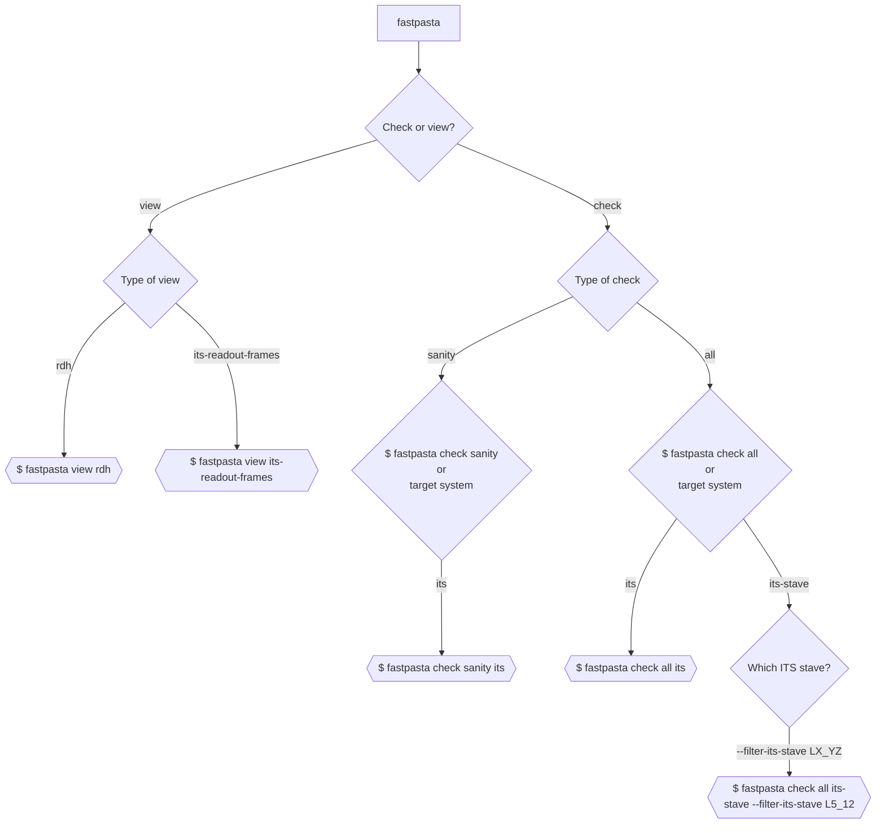

# fastPASTA
[](https://gitlab.cern.ch/mkonig/fastpasta/-/commits/master)
 [](https://gitlab.cern.ch/mkonig/fastpasta/-/commits/master)
 [](https://gitlab.cern.ch/mkonig/fastpasta/-/releases)

## fast Protocol Analysis Scanner Tool for ALICE
fastPASTA uses [Semantic Versioning](https://semver.org/).

For extensive documentation of public facing source code see [documentation](https://docs.rs/fastpasta/1.0.1/fastpasta/) or invoke ```cargo doc --open```.

For an exhaustive list of the data verification done via the `check` subcommand, see [list of checks](doc/checks_list.md).

Releases and associated changelogs can be found at [releases](https://gitlab.cern.ch/mkonig/fastpasta/-/releases).

## Purpose

To verify or view curated content of the scanned raw binary data from ALICE.

## Demo


# Table of Contents
- [fastPASTA](#fastpasta)
  - [fast Protocol Analysis Scanner Tool for ALICE](#fast-protocol-analysis-scanner-tool-for-alice)
  - [Purpose](#purpose)
  - [Demo](#demo)
- [Table of Contents](#table-of-contents)
- [Quickstart](#quickstart)
  - [Prerequisite](#prerequisite)
  - [Install via cargo (comes with Rust)](#install-via-cargo-comes-with-rust)
  - [Building from source](#building-from-source)
  - [See help, including examples of use](#see-help-including-examples-of-use)
  - [Examples of use](#examples-of-use)
    - [Read from stdin -\> filter link -\> view RDHs](#read-from-stdin---filter-link---view-rdhs)
    - [Read from file -\> filter by link -\> validate](#read-from-file---filter-by-link---validate)
    - [Read from file -\> view ITS readout frames with `less`](#read-from-file---view-its-readout-frames-with-less)
  - [Command flow](#command-flow)
- [Error messages](#error-messages)
    - [Messages are formatted as follows:](#messages-are-formatted-as-follows)
    - [Example of failed RDH sanity check](#example-of-failed-rdh-sanity-check)
    - [Error codes are not unique](#error-codes-are-not-unique)
  - [Verbosity levels](#verbosity-levels)
  - [Running tests](#running-tests)
- [License](#license)
- [Project status](#project-status)
- [Benchmarks and comparisons](#benchmarks-and-comparisons)
    - [Verifying all RDHs of 260MB file with data from 1 link](#verifying-all-rdhs-of-260mb-file-with-data-from-1-link)
    - [Verifying all RDHs in 3GB file with data from 2 different GBT links](#verifying-all-rdhs-in-3gb-file-with-data-from-2-different-gbt-links)
    - [Verifying all RDHs and payloads in 260MB file with data from 1 link](#verifying-all-rdhs-and-payloads-in-260mb-file-with-data-from-1-link)
- [Need more performance?](#need-more-performance)
    - [Background](#background)
    - [To install the nightly toolchain (and check your installation)](#to-install-the-nightly-toolchain-and-check-your-installation)
    - [Compile the optimized `release-nightly` experimental build profile](#compile-the-optimized-release-nightly-experimental-build-profile)
    - [Path to binary: `/target/release-nightly/fastpasta`](#path-to-binary-targetrelease-nightlyfastpasta)

# Quickstart
## Prerequisite
The [rust toolchain](https://www.rust-lang.org/tools/install) is required to compile the binary. Use the link to download a Windows installer. On macOS, Linux or other Unix-like OS simply run
```shell
curl --proto '=https' --tlsv1.2 -sSf https://sh.rustup.rs | sh
```
and follow the on-screen instructions.

## Install via cargo (comes with Rust)
```shell
cargo install fastpasta
```
Updating fastpasta simply requires rerunning `cargo install fastpasta`
## Building from source
Run `cargo build -r` and find the binary in /target/release/fastpasta
## See help, including examples of use

```shell
$ fastpasta -h
```

## Examples of use

### Read from stdin -> filter link -> view RDHs
```shell

$ lz4 -d input.raw -c | fastpasta --filter-link 3 | fastpasta view rdh
#        ^^^^                      ^^^^                       ^^^^
#       INPUT       --->          FILTER          --->        VIEW
# Decompressing with `lz4`
```

Piping is often optional and avoiding it will improve performance. e.g. the following is equivalent to the previous example, but saves significant IO overhead, by using one less pipe.
```shell
$ lz4 -d input.raw -c | fastpasta --filter-link 3 view rdh
```
### Read from file -> filter by link -> validate
Enable all generic checks: `sanity` (stateless) AND `running` (stateful)
```shell
$ fastpasta input.raw --filter-link 0 check all
```
Enable all `sanity` checks and include checks applicable to `ITS` only
```shell
$ fastpasta input.raw check sanity its --filter-link 0
```

### Read from file -> view ITS readout frames with `less`
Generate ITS readout frame view
```shell
$ fastpasta input.raw view its-readout-frames | less
```
View only readout frames from link #3
```shell
$ fastpasta input.raw view its-readout-frames -f 3 | less
```


## Command flow


# Error messages
### Messages are formatted as follows:

```shell
MEMORY_OFFSET: [ERROR_CODE] ERROR_MESSAGE
```
### Example of failed RDH sanity check
```shell
0xE450FFD: [E10] RDH sanity check failed: data_format = 255
```

### Error codes are not unique
But they signify categories of errors.
E.g. all RDH sanity checks have the same error code, but the error message will specify which field failed.
The following is a list of error codes and their meaning, `x` is a placeholder for any number 0-9.
* [Ex0] - Sanity check
* [E1x] - RDH
* [E3x] - IHW
* [E4x] - TDH
* [E5x] - TDT
* [E6x] - DDW0
* [E7x] - Data word (Even number: IB, Odd number: OB) E70 is sanity check for both IB/OB.
* [E8x] - CDW
* [E99] - Miscellaneous, such as error in ID when 2 or more words could be valid in the current state.

## Verbosity levels
- 0: Errors
- 1: Errors and warnings
- 2: Errors, warnings and info
- 3: Errors, warnings, info and debug
- 4: Errors, warnings, info, debug and trace


## Running tests
Run the full test suite with:
```shell
$ cargo test -- --test-threads=1 --nocapture
```
Passing `--test-threads=1` and `--nocapture` is necessary as several tests asserts that content written to stdout matches expectations, which will break when tests are run concurrently or writing to stdout is suppressed.

# License
Apache 2.0 or MIT at your option.

# Project status
Passively Maintained. There are no plans for new features, but the maintainer intends to respond to issues that get filed.

# Benchmarks and comparisons
In the tables below `fastPASTA` is compared with `rawdata-parser` and `decode.py` in typical verification tasks. Hyperfine is used for benchmarking, with `cache warmup`.
### Verifying all RDHs of 260MB file with data from 1 link
| Tool | Command | Mean [s] | Min [s] | Max [s] |
|:---|:---|---:|---:|---:|
|fastPASTA| `fastpasta input.raw check all` | 0.039 ± 0.001 | 0.037 | 0.043 |
|rawdata-parser| `./rawdata-parser --skip-packet-counter-checks input.raw` | 0.381 ± 0.012 | 0.356 | 0.438|
|decode.py| `python3 decode.py -i 20522 -f input.raw --skip_data` | 13.674 ± 0.386 | 13.610 | 14.499 |

### Verifying all RDHs in 3GB file with data from 2 different GBT links
| Tool | Command | Mean [s] | Min [s] | Max [s] |
|:---|:---|---:|---:|---:|
|fastPASTA| `fastpasta input.raw check all` | 0.504 ± 0.010 | 0.482 | 0.530 |
|rawdata-parser| `rawdata-parser input.raw` | 2.951 ± 0.102 | 2.867 | 3.300 |
|decode.py| Verifying multiple links simultaneously is not supported | N/A | N/A | N/A |

### Verifying all RDHs and payloads in 260MB file with data from 1 link
| Tool | Command | Mean [s] | Min [s] | Max [s] |
|:---|:---|---:|---:|---:|
|fastPASTA| `fastpasta input.raw check all ITS` | 0.106 ± 0.002 | 0.103 | 0.111 |
|rawdata-parser| Verifying payloads is not supported  | N/A | N/A | N/A |
|decode.py| `python3 decode.py -i 20522 -f input.raw` | 55.903 ± 0.571 | 54.561 | 56.837 |


# Need more performance?
The primary release profile of fastPASTA is already very fast, but if you absolutely need 10-20% more speed, a faster build profile exists that utilizes the experimental `rust nightly` toolchain.

### Background
The rust compiler `rustc` does not yet provide access to all the features that its backend `LLVM` has. But the experimental `nightly` rust toolchain allows passing flags directly to `LLVM`. fastPASTA includes configuration for a build profile `release-nightly` which utilizes `LLVM` to achieve more speed at the cost of compilation time and binary size. As of this writing, the stable channel of Rust does not have a way to pass compiler flags to the LLVM backend. The increased speed is mainly achieved through configuring a higher threshold for inlining, which will increase speed but also compilation time and binary size, and most crucially, cache pressure. The performance impact will be highly dependent on the machine fastPASTA runs on. Better/more CPU cache will lead to a higher performance gain. With >1 GB individual link data, the performance on one particular CERN machine running CentOS Stream 8, as measured by [`hyperfine`](https://github.com/sharkdp/hyperfine) increased by ~17%.

### To install the nightly toolchain (and check your installation)
```shell
$ rustup toolchain install nightly
$ rustup run nightly rustc --version
```
### Compile the optimized `release-nightly` experimental build profile
```shell
$ cargo +nightly build --profile release-nightly
```
### Path to binary: `/target/release-nightly/fastpasta`
