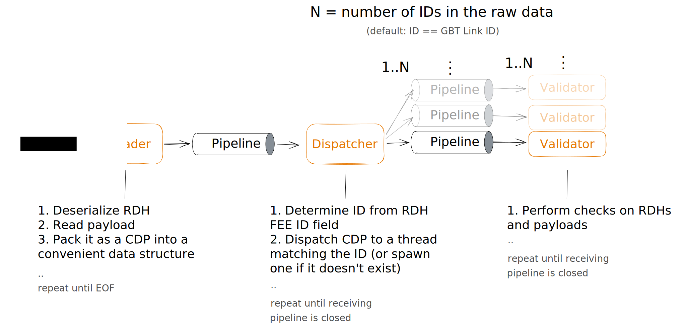
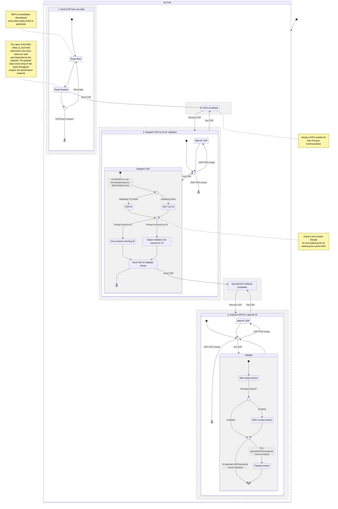

# Dataflow in fastPASTA
- [Dataflow in fastPASTA](#dataflow-in-fastpasta)
  - [Simple overview](#simple-overview)
  - [Detailed overview](#detailed-overview)


## Simple overview

When executing fastPASTA with in  `check`-mode e.g.
```shell
fastpasta check all its bin.raw
```
The resulting data flow is illustrated below viewed from the highest level.

Each orange box runs in a seperate thread.
Pipelines are shared between threads and are essentially thread-safe FIFOs.


## Detailed overview

The state diagram below offers more details to illustrate the data flow than in the [Simple overview](#simple-overview) section. For even more details you will have to look into the source code.


